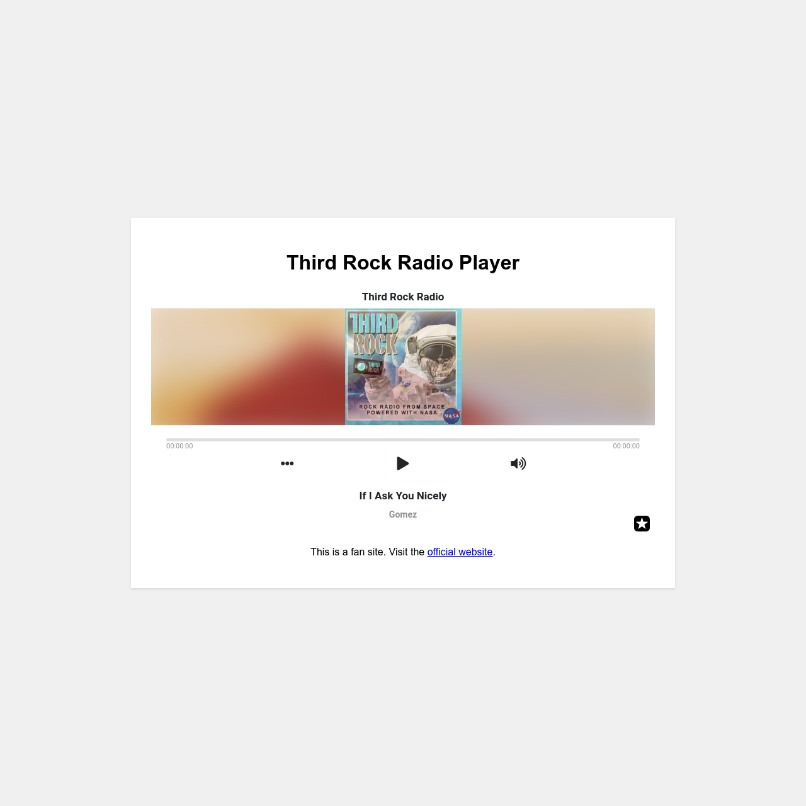

# Third Rock Radio Player

This project is a fan-made web app for Third Rock Radio, allowing users to stream the station's music directly from their browser. It features a simple interface with a player that integrates seamlessly, offering music lovers easy access to the space-themed station.

## Features
- **Third Rock Radio Stream**: Embed a player to stream Third Rock Radio directly within the webpage, providing easy access to music.
- **Responsive Design**: The player interface adapts to different screen sizes, ensuring a great experience across both mobile and desktop devices.
- **Service Worker for Offline Capability**: Uses a service worker to cache essential files, providing limited offline capabilities for the site.
- **PWA Features**: Includes manifest and icons to allow the site to be installed as a Progressive Web App (PWA) on devices.

## Files
- **index.html**: Contains the main HTML structure, including the player iframe for streaming Third Rock Radio and a link to the official site as a disclaimer.
- **styles.css**: Manages the styling for the player interface, providing a clean and user-friendly experience. The design is kept simple to emphasize functionality.
- **sw.js**: Implements the service worker, responsible for caching essential files for offline capabilities.
- **manifest.json**: Configures the Progressive Web App settings, such as the app name, icons, and theme color.

## Technologies Used
- **HTML5**: Provides the structure for the web app, including the embedded radio player and all related elements.
- **CSS3**: Styles the layout and elements, ensuring the app is visually appealing and consistent across different devices.
- **JavaScript**: Registers the service worker to provide caching functionality and enhance the user experience.
- **Service Worker**: Adds offline support by caching files during installation.
- **PWA Features**: Uses a manifest file to allow installation of the web app on mobile devices and desktop systems.

## Screenshot

## License
This project is open-source and available under the MIT License.